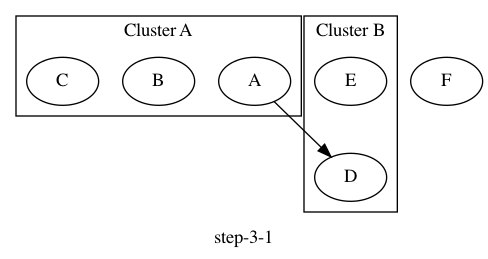
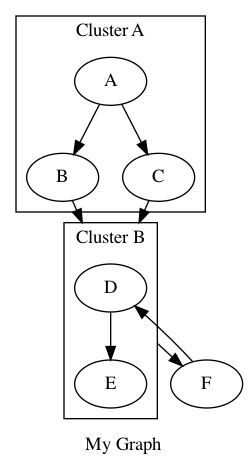

# Architectures

[](/LICENSE)


## Introduction
Today, almost everything is managed as code including applications, infrastructure, configurations, processes, and more.  Architectures was created to allow teams to manage architecture as code using Python.

The goal for this project is to make drawing architecture diagrams with code simple and to enable the use of version control systems and standard coding practices such as pull requests, code reviews, and approvals to eliminate the toil associated with diagram creation and maintenance.

Architectures comes with support for a wide variety of cloud and on-premise providers out-of-the-box.


## Dependencies
Architectures works for all version of python greater than version `3.6.x`.

Architectures can be installed from PyPi using pip:
```
pip install architectures
```
The Graphviz library is also required.  To install it, simply run the following pip command in the terminal:
```
pip install graphviz
```
If you are using a MacBook for development, you may also have to install the latest version of Graphviz with Homebrew:
```
brew install graphviz
```

## Supported Objects
There are several types of supported objects in the architectures library.  These objects primarily fall into three categories:
### Containers
- **Graphs** allow users to create a base canvas to create their diagram on
- **Clusters** allow users to group **Nodes** into bounded container
- **Groups** allow users to logically group **Nodes** with no bounding container
### Components
- **Nodes** allow users to create an object that represents a service
- **Anchors** _[coming soon]_ will allow users to better control direction and connection points of Edges.
### Connections
- **Edges** allow users to draw a line between a pair or list of **Nodes**, **Clusters**, or **Groups**
- **Flows** allow users to create a linear flow through a list of **Nodes**, **Clusters**, or **Groups**

The component objects are extended with subclasses that allow for the creation of standard service components from various providers such as Azure, GCP, and AWS.

## Example
### Azure Event Driven Serverless Architecture
Here is an example that shows how you can create a beautiful diagram using architectures.

#### Code
```
from architectures.core import *
from architectures.themes import LightMode, DarkMode

from architectures.providers.azure.ai import CognitiveServices
from architectures.providers.azure.application import FunctionApp, EventGridDomain
from architectures.providers.azure.data import AzureCosmosDb
from architectures.providers.azure.general import Computer
from architectures.providers.azure.storage import StorageAccountBlob

theme = DarkMode()

with Graph("Event Driven Serverless Architecture", theme=theme):
    computer = Computer("Single Page Web App")
    with Cluster():
        function_get_upload_url = FunctionApp("Function (get upload url)")
        function_list_images = FunctionApp("Function (list images)")
        function_resize = FunctionApp("Function (resize & recognize image)")
        function_write_metadata = FunctionApp("Function (write metadata)")
    blob_storage = StorageAccountBlob("Blob Storage (images, thumbnails)")
    event_grid = EventGridDomain("Event Grid (async events)")
    cosmos_db = AzureCosmosDb("Cosmos DB (image metadata)")
    cognitive_services = CognitiveServices("Cognitive Services (computer vision)")

    # Flow([function_get_upload_url, function_list_images, function_resize], color="green")
    Flow([computer, [function_get_upload_url, blob_storage, function_list_images]])
    Edge([function_get_upload_url, function_resize], blob_storage)
    Edge(blob_storage, function_resize, style="dashed")
    Edge(function_resize, [cognitive_services, event_grid])
    Edge(event_grid, function_write_metadata, style="dashed")
    Edge(function_write_metadata, cosmos_db)
    Edge(function_list_images, cosmos_db, constraint="false") # This constraint setting ensures the edge does not force ranking
    Edge(function_resize, function_write_metadata, color="invis") # This ensures alignment between these two function apps
```
#### Output


## How To
This step-by-step guide will walk you through the features and functionalities of architectures so you can start writing your own architecture as code.

### Step 1 - Importing Objects
There are several things you will want to import to get started.  The first will be the `core` components.
```
from architectures.core import Graph, Cluster, Group, Node, Edge, Flow
```
For more information on these objects, see the [Supported Objects](##supported-objects) section above.

The next important set of imports to know about are `themes`.  Themes are what give your graph the styling you want.  You can use what is available as is, pass in attribute overrides, or create entirely new themes to fit your needs.
```
from architectures.themes import Default, LightMode, DarkMode
```
If you are creating a diagram that uses provider services (such as AWS, GCP, or Azure), you will also need to import the services you want to use for those `providers`.

Here is an example that import an Azure Virtual Machine:
```
from architectures.providers.azure.compute import VirtualMachine
```
Importing this class will allow you to draw an Azure Virtual Machine on the graph.

### Step 2 - Adding Nodes to a Graph
Architectures supports the standard Graphviz formatting out-of-the-box.  To create a basic graph with a single, unlabeled node, you would do something like this.
```
from architectures.core import Graph, Node

with Graph("My Graph"):
    Node()
```
You can give a Node a name.
```
from architectures.core import Graph, Node

with Graph("My Graph"):
    Node("My Node")
```
And pass attributes as keyword arguments to change the way things look.
```
from architectures.core import Graph, Node

with Graph("My Graph"):
    Node("My Node", style="dotted", color="grey")
```
You can add multiple Nodes to a Graph.
```
from architectures.core import Graph, Node

with Graph("My Graph"):
    Node("A")
    Node("B")
    Node("C")
    Node("D")
    Node("E")
```
And you can group Nodes with Clusters.  Don't forget to import the Cluster class.
```
from architectures.core import Graph, Cluster, Node

with Graph("My Graph"):
    with Cluster("Cluster A"):
        Node("A")
        Node("B")
        Node("C")

    with Cluster("Cluster B"):
        Node("D")
        Node("E")

    Node("F")
```
The resulting graph based on the above code looks like this:


Note that Clusters will always draw a boxes around the Nodes they contain.  If you want to cluster Nodes together without the border you can use the Group object by importing it with the other core objects.

You can use the Group object in the exact same way as the Cluster object, so not additional example is given here.
```
from architectures.core import Graph, Cluster, Group, Node
```

Also important to note is that objects are created in the reverse order that they are written in the code.  This is not always something you have to consider, but keep in mind it can have an impact on the final layout.  In particular for larger, more complex diagrams.

### Step 3 - Connecting Nodes and Clusters
A collection of Nodes and Clusters might not be all that useful by themselves.  To start showing relationships, we need to draw lines between them.  This can be done by importing the Edge and Flow objects.
```
from architectures.core import Graph, Cluster, Group, Node, Edge, Flow
```
You can draw a line from a Node to a Node using an Edge.  To do this, we should assign each node to a variable.

```
from architectures.core import Graph, Cluster, Group, Node, Edge, Flow

with Graph("My Graph"):
    with Cluster("Cluster A"):
        a = Node("A")
        b = Node("B")
        c = Node("C")

    with Cluster("Cluster B"):
        d = Node("D")
        e = Node("E")

    f = Node("F")

    # This will connect nodes a and d
    Edge(a, d)
```


You can also connect Nodes to Clusters or Groups.  To do this, we should also assign each cluster to a variable.
```
from architectures.core import Graph, Cluster, Group, Node, Edge, Flow

with Graph("My Graph"):
    with Cluster("Cluster A") as cluster_a:
        a = Node("A")
        b = Node("B")
        c = Node("C")

    with Cluster("Cluster B") as cluster_b:
        d = Node("D")
        e = Node("E")

    f = Node("F")

    # This will connect node b to cluster b
    Edge(b, cluster_b)
```


In fact, you can connect any combination of Nodes and Clusters to each other using the Edge object.  You can also pass keyword arguments to modify attributes on an Edge.
```
from architectures.core import Graph, Cluster, Group, Node, Edge, Flow

with Graph("My Graph"):
    with Cluster("Cluster A") as cluster_a:
        a = Node("A")
        b = Node("B")
        c = Node("C")

    with Cluster("Cluster B") as cluster_b:
        d = Node("D")
        e = Node("E")

    f = Node("F")

    # Every combination of Node and Cluster objects with attributes
    Edge(a, d, dir="both")
    Edge(cluster_a, e, color="blue")
    Edge(cluster_a, cluster_b)
    Edge(f, cluster_b, style="dotted")
```


The Flow object is similar to the Edge object in that it can connect Nodes.  However, it allows for a list of objects so you can create an end-to-end flow on a diagram.
```
from architectures.core import Graph, Cluster, Group, Node, Edge, Flow

with Graph("My Graph"):
    with Cluster("Cluster A") as cluster_a:
        a = Node("A")
        b = Node("B")
        c = Node("C")

    with Cluster("Cluster B") as cluster_b:
        d = Node("D")
        e = Node("E")

    f = Node("F")

    Flow([a, [b, c], cluster_b, f, d, e])
```


As you can see, the Flow object is a powerful way to streamline your code when connecting multiple Node objects together in sequence.

Note that, as with Edges, the Flow object also accepts keyword arguments to set attributes.

### Step 4 - Using Service Providers
Architectures supports a variety of providers and themes to allow you to create beautiful architecture diagrams.  Each provider service works exactly like the Node object as they are children classes.

Here is an example of how you can import services and themes to create a nice looking diagram.
```
# Import the base objects
from architectures.core import Graph, Cluster, Group, Node, Edge, Flow

# Import the available themes
from architectures.themes import LightMode, DarkMode

# Import provider services
from architectures.providers.azure.networking import ApplicationGateway, LoadBalancer
from architectures.providers.azure.compute import VirtualMachineWindows
from architectures.providers.azure.data import DataLake

# Set the theme
theme = LightMode()

with Graph("Basic Architecture", theme=theme):
    with Cluster("Subscription"):
        with Cluster("Resource Group"):
            with Cluster("Virtual Network"):
                with Cluster("App Gateway Subnet") as app_gateway_subnet:
                    app_gateway = ApplicationGateway()
                with Cluster("Build Subnet") as build_subnet:
                    load_balancer = LoadBalancer()
                    vm_1 = VirtualMachineWindows()
                    vm_2 = VirtualMachineWindows()
                with Cluster("Data Tier Subnet") as data_tier_subnet:
                    data_lake = DataLake()

    Flow([app_gateway_subnet, load_balancer, [vm_1, vm_2]])
    Edge(build_subnet, data_lake)
```


This demonstrates what the default `LightMode` theme looks like.

### Step 5 - Modifying Themes

You can overwrite default settings when using a theme to fine tune the settings that you want by passing dictionaries of attribute key, value pairs to `graph_attr_overrides`, `cluster_attr_overrides`, `node_attr_overrides`, `edge_attr_overrides`, and `color_overries`.

For more information on available attributes, check out the [Graphviz Attributes Documentation](https://graphviz.org/doc/info/attrs.html).
```
# Import the base objects
from architectures.core import Graph, Cluster, Group, Node, Edge, Flow

# Import the available themes
from architectures.themes import LightMode, DarkMode

# Import provider services
from architectures.providers.azure.networking import ApplicationGateway, LoadBalancer
from architectures.providers.azure.compute import VirtualMachineWindows
from architectures.providers.azure.data import DataLake

# Set the theme
theme = LightMode(
    graph_attr_overrides={"labeljust":"c", "nodesep":"0.5"}, 
    cluster_attr_overrides={"style":"dotted"},
    node_attr_overrides={"fontcolor":"dimgrey"}, 
    edge_attr_overrides={"color":"dimgrey"},
    color_overrides=["#F5F5F5", "#FAFAFA", "#ECECEC", "#DEDEDE"]
)

with Graph("My Customized Theme", theme=theme):
    with Cluster("Subscription"):
        with Cluster("Resource Group"):
            with Cluster("Virtual Network"):
                with Cluster("App Gateway Subnet") as app_gateway_subnet:
                    app_gateway = ApplicationGateway()
                
                with Cluster("Build Subnet") as build_subnet:
                    load_balancer = LoadBalancer()
                    vm_1 = VirtualMachineWindows()
                    vm_2 = VirtualMachineWindows()
                
            data_lake = DataLake()

    Flow([app_gateway_subnet, load_balancer, [vm_1, vm_2]])
    Edge(build_subnet, data_lake)
```


To apply `DarkMode`, just change the name of the theme.
```
# Import the base objects
from architectures.core import Graph, Cluster, Group, Node, Edge, Flow

# Import the available themes
from architectures.themes import LightMode, DarkMode

# Import provider services
from architectures.providers.azure.networking import ApplicationGateway, LoadBalancer
from architectures.providers.azure.compute import VirtualMachineWindows
from architectures.providers.azure.data import DataLake

# Set the theme
theme = DarkMode()

with Graph("My Customized Theme", theme=theme):
    with Cluster("Subscription"):
        with Cluster("Resource Group"):
            with Cluster("Virtual Network"):
                with Cluster("App Gateway Subnet") as app_gateway_subnet:
                    app_gateway = ApplicationGateway()
                
                with Cluster("Build Subnet") as build_subnet:
                    load_balancer = LoadBalancer()
                    vm_1 = VirtualMachineWindows()
                    vm_2 = VirtualMachineWindows()
                
            data_lake = DataLake()

    Flow([app_gateway_subnet, load_balancer, [vm_1, vm_2]])
    Edge(build_subnet, data_lake)
```
